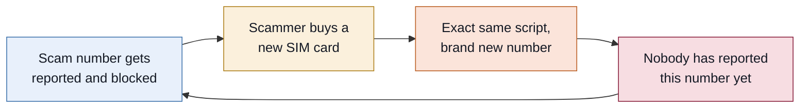
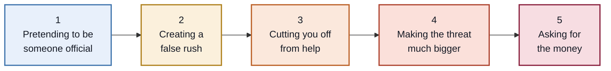
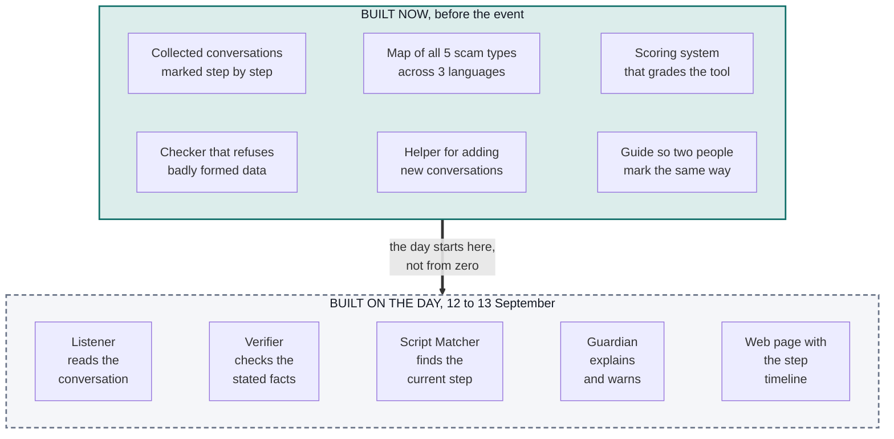
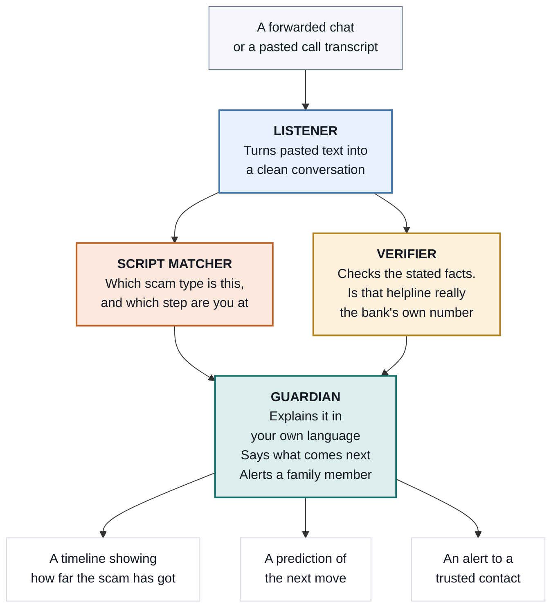
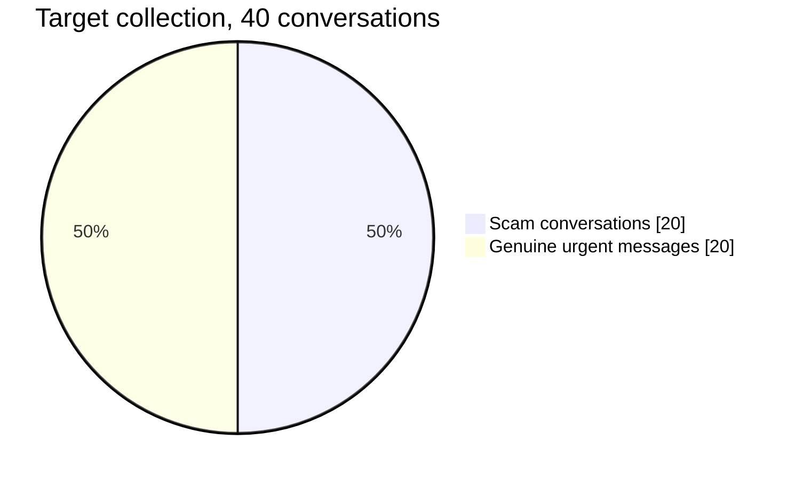
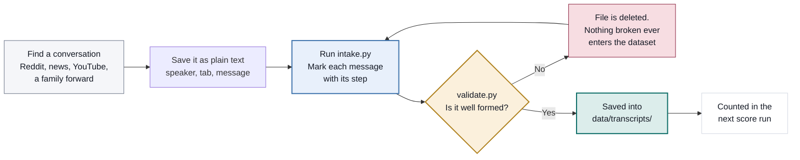
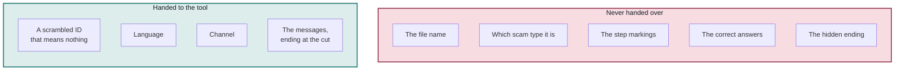
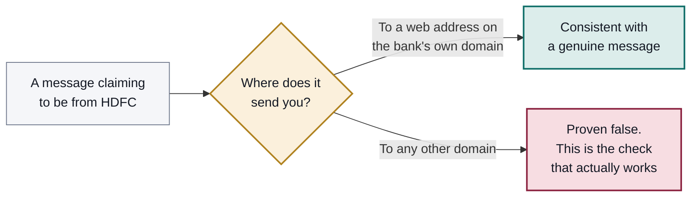
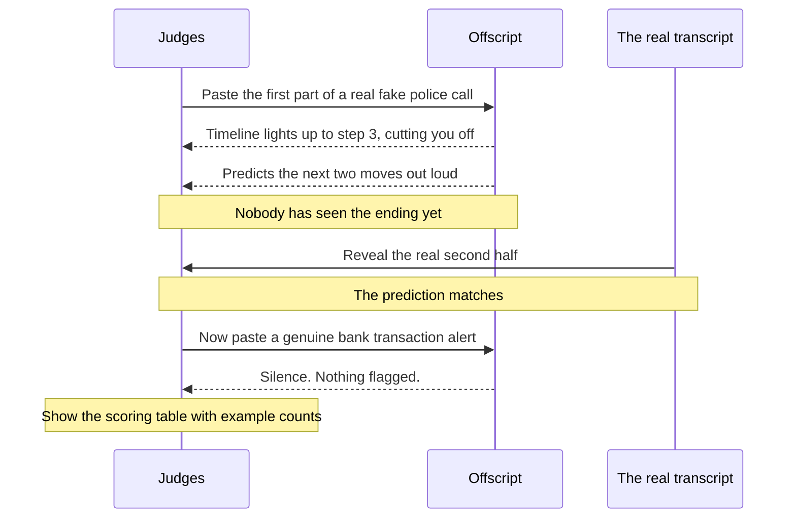

# Offscript

**Every scam follows a script. We take you off it.**

Offscript spots financial scams in India by reading **how a conversation is being steered**, not by checking **who is calling**.

**Team InnovativeOrbits** at **HackIndia x Appinventiv AI Hackathon 2026**, Noida, 12 to 13 September.

```bash
git clone https://github.com/HackIndiaXYZ/hackindia-appinventiv-ai-hackathon-2026-innovativeorbits.git
cd hackindia-appinventiv-ai-hackathon-2026-innovativeorbits
python eval/validate.py
```

---

## Table of contents

1. [The problem](#the-problem)
2. [The insight](#the-insight)
3. [The five steps](#the-five-steps)
4. [What is built and what is not](#what-is-built-and-what-is-not)
5. [How the pieces fit together](#how-the-pieces-fit-together)
6. [Quick start](#quick-start)
7. [Inside the repository](#inside-the-repository)
8. [The dataset](#the-dataset)
9. [How a conversation becomes a record](#how-a-conversation-becomes-a-record)
10. [The scoring system](#the-scoring-system)
11. [Where the numbers stand today](#where-the-numbers-stand-today)
12. [What we know we cannot do](#what-we-know-we-cannot-do)
13. [Hackathon day plan](#hackathon-day-plan)
14. [The demo](#the-demo)
15. [A note on the rules](#a-note-on-the-rules)

---

## The problem

India runs the largest real time payments system in the world, and fraud has grown right alongside it. Fake police calls that keep people under so called digital arrest for hours. Fake customer care numbers planted in search results. Bank KYC expiry messages. Loan apps that harvest your contact list and then threaten to message everyone in it.

The people hit hardest are first time smartphone users, elderly parents, and anyone who does not read English comfortably.

**Every existing defence is a blocklist, and a blocklist is always one step behind.** A scammer buys a new number in about a minute, and the same script works again the next morning.



The number is disposable. The script is not, because the script is the part that actually works.

---

## The insight

We do not try to recognise the sender. We recognise **the shape of the manipulation**.

Scams run through the same steps whether they arrive as a call or a text message, in Telugu or in Hindi, pretending to be the police or pretending to be your bank. A filter hunting for suspicious keywords cannot see a shape like that. Something that actually reads the conversation can.

---

## The five steps



| Step | Name | What it sounds like | Why it works |
|:---:|---|---|---|
| **0** | Nothing harmful here | You replying, a greeting, the header line on a text | Not every message is an attack. Genuine alerts sit entirely at step 0 |
| **1** | Pretending to be someone official | "I am calling from the Cyber Crime Branch." "Dear customer, this is the bank verification department." | You stop judging the caller and start cooperating with an institution |
| **2** | Creating a false rush | "We have only two hours before the file goes to court." "Your account closes at 11 tonight." | It removes the one thing that would save you, which is time to check |
| **3** | Cutting you off from help | "Do not tell your wife or your son." "Stay on this video call." "The branch server is down." | It deletes the second opinion. Often disguised as safety advice with one exception carved out for the caller |
| **4** | Making the threat much bigger | "Police at your door in thirty minutes, with the media." "Your CIBIL score is gone." | Fear this size stops people thinking clearly. That is exactly what it is for |
| **5** | Asking for the money | "Transfer your balance to the RBI verification account, refunded in three hours." "Share the OTP." | It is never called a payment. It is a verification, a formality, a refund |

**The five scam types we have mapped**

| Type | Plain name | Usually arrives as |
|---|---|---|
| `digital_arrest` | Fake police or CBI custody threat | Phone call |
| `kyc_expiry` | Bank or wallet KYC expiry | SMS, WhatsApp |
| `fake_support` | Fake customer care number | Phone call |
| `loan_app` | Loan app harassment | WhatsApp, call |
| `task_scam` | Job or task based investment scam | Telegram, WhatsApp |

Each one lives in [`scripts/`](scripts/) as a file listing all five steps, the phrases used at each step in English, Hindi and Telugu, the emotion being pulled on, and the two most likely next moves.

---

## What is built and what is not

**This is the most important section in this file, so it comes before the code.**

The hackathon rules require the working software to be written **during the event**. So this repository deliberately contains **no product code**. There is no app, no user interface, no server, no AI model calls, no API clients.

What it contains instead is the groundwork that makes the software worth building: the collected conversations, the map of how each scam behaves, and the scoring system that will judge the finished tool.



The advantage is simple. Most teams spend the first six hours of a hackathon arguing about what to build and hunting for test data. We start with the test data already collected and the scoring already written, so hour one is spent writing the tool itself.

---

## How the pieces fit together

Four parts, each with one job.



The **Verifier** is what stops this being a mood detector. Anyone can build something that flags scary words. Checking whether the helpline in the message is genuinely the bank's published number is a fact, and facts are what hold up under questioning.

---

## Quick start

Everything runs on **plain Python 3 with nothing installed**. No libraries, no internet connection, nothing that venue wifi can break.

```bash
# 1. Check every collected conversation is well formed
python eval/validate.py

# 2. See the current scores
python eval/run_eval.py
python eval/run_eval.py --per-item     # with a row per conversation

# 3. Add a new conversation, guided step by step
python tools/intake.py raw/my_transcript.txt

# 4. Compare two people's marking of the same conversations
python eval/agreement.py data/annot_a data/annot_b
```

On Windows PowerShell, set the output encoding first so Telugu and Hindi print correctly:

```powershell
$env:PYTHONIOENCODING='utf-8'; python eval/validate.py
```

**A visual overview of the project** lives at [`deck/dossier.html`](deck/dossier.html). Open it in any browser, no setup needed.

---

## Inside the repository

```
offscript/
│
├── PROJECT.md              The plan. Scope, day of timeline, demo script
├── README.md               This file
│
├── data/
│   ├── schema.json         The shape every conversation file must follow
│   ├── ANNOTATION.md       How to decide which step a message belongs to
│   ├── COLLECTION.md       Collection tracker, sources, quality gates
│   ├── allowlists/         Real bank numbers, each with a link proving it
│   └── transcripts/        The collected conversations, one file each
│
├── scripts/                How each of the 5 scam types behaves
│   ├── digital_arrest.yaml     Full reference version
│   ├── kyc_expiry.yaml
│   ├── fake_support.yaml
│   ├── loan_app.yaml
│   └── task_scam.yaml
│
├── eval/
│   ├── validate.py         Refuses anything badly formed, loudly
│   ├── run_eval.py         Works out the scores
│   ├── agreement.py        Compares two people's marking
│   └── metrics.md          Results table and a log of every run
│
├── tools/
│   └── intake.py           Walks you through adding a conversation
│
├── raw/                    Drop new material here to begin
├── prompts/                Written during the event
└── deck/                   Pitch material and the overview page
```

---

## The dataset

**The dataset is the part nobody can copy.** Anyone can describe this idea in a pitch. Very few teams will turn up with forty real conversations, marked message by message, half of them genuine.

**Target: 40 conversations, split evenly.**



The genuine half is the half that wins. It is the only way to prove the tool does not cry wolf, and most teams skip it entirely because collecting scams feels more productive.

**The genuine half must be genuinely alarming.** A cheerful marketing text proves nothing. The three we specifically want:

| Genuine message | Why it is hard |
|---|---|
| A real bank fraud team calling you | It impersonates nobody, yet it has authority, urgency, and asks you to act right now |
| A real EMI bounce warning mentioning CIBIL | Our `kyc_expiry` scam uses that exact threat at step 4 |
| A real electricity disconnection notice | Same day deadline. Urgency on its own must never trigger a flag |

> **On the slide:** these three genuine messages use the same fear vocabulary as our step 4. Offscript stays silent on all three.

**What a single record looks like**

Every conversation is one JSON file. Names are invented, account numbers are placeholders, scam web addresses use the reserved `.invalid` ending so they can never resolve to anything real.

```json
{
  "id": "scam_digital_arrest_01",
  "type": "scam",
  "script": "digital_arrest",
  "language": "hinglish",
  "channel": "call",
  "turns": [
    { "speaker": "counterparty", "text": "Main Sub-Inspector bol raha hoon..." },
    { "speaker": "victim",       "text": "Kaunsa parcel sir?" }
  ],
  "stage_labels": [1, 0],
  "truncate_at_turn": 8,
  "hard_claims": [
    {
      "claim": "FIR number 0000/2026",
      "kind": "case_number",
      "expected_verdict": "verified_false",
      "rationale": "A real FIR reference carries a police station code. This one has none."
    }
  ],
  "ground_truth": { "is_scam": true, "final_stage": 5, "next_stage": 5 }
}
```

### Three verdicts, never two

When Offscript checks a stated fact, there are **three** possible answers, not two.

| Verdict | Meaning |
|---|---|
| `verified_true` | It matches a real entry in [`data/allowlists/`](data/allowlists/) |
| `verified_false` | It is provably wrong |
| `unverifiable` | No source exists to settle it, and we say so |

**Never round `unverifiable` down to `verified_false`** just to make a scam look worse. Doing that inflates the Verifier and pushes up the false alarm rate, which is the exact number we are trying to win on.

### Every allowlist entry needs proof

A number in [`data/allowlists/bank_shortcodes.json`](data/allowlists/bank_shortcodes.json) is only usable if it carries a `source_url` pointing at the bank's own published page and a `verified_on` date.

This rule exists because it has already saved us once. An early version of this dataset carried a bank helpline that turned out **not to appear anywhere on the bank's official site**. It was corrected against the published page before it ever reached a slide. A judge with a phone would have found it in ten seconds.

`eval/validate.py` now **fails the whole dataset** if any fact is marked `verified_true` without a matching proven allowlist entry.

---

## How a conversation becomes a record



The raw text format is one message per line, speaker then a **tab** then the message:

```
counterparty	Namaskar, main Cyber Crime Branch se bol raha hoon.
victim	Kaunsa parcel sir?
counterparty	FIR number 0000/2026 register ho chuki hai.
```

`tools/intake.py` then shows you the step definitions on screen as you mark each message, works out the cut point for you, warns if anything looking like a real mobile number appears in the text, and **deletes its own output if the result does not validate**.

**Before your first conversation, read [`data/ANNOTATION.md`](data/ANNOTATION.md).** Ten minutes, once. It gives every step a definition, two examples, and one near miss that should *not* get that step, plus tie break rules for the three cases that actually cause arguments.

---

## The scoring system

### Conversations are stored whole. We hide the ending at scoring time.

Every scam conversation is stored **complete, right through step 5**. It also carries `truncate_at_turn`, the point where the scoring system stops showing it to the tool.

Take the fake police call. Twelve messages, cut after the ninth:

```
message   1   2   3   4   5   6   7   8   9  │  10  11  12
step      1   0   1   2   0   3   3   0   4  │   0   5   5
              shown to the tool              │      hidden
                                             ↑
                                     the tool must guess
                                     what comes after here
```

The tool sees the caller threaten to arrive with the media, and has to work out on its own that a demand for money is next. Then we reveal the real ending and check.

**Why this matters:** if we simply collected conversations that happened to stop early, only a handful would test prediction. By hiding the ending at scoring time instead, **all twenty scam conversations** test it. Same data, far more measurement.

### The tool cannot cheat

The scoring system hands the tool exactly four things and nothing else.



File names stay readable for humans, like `scam_digital_arrest_03.json`. But the tool only ever receives a scrambled eight character ID, so it cannot read the answer off the file name. That would be silent cheating and it would quietly ruin every number below.

### Every score carries how many examples it came from

A percentage with no denominator can mean anything, and it is the first thing a judge asks about. So the results table has a column for it, always.

### Two people, one standard

Deciding which step a message belongs to takes judgement. If two people quietly disagree, every number becomes meaningless.

So one in ten conversations gets marked by **both** people independently, and `eval/agreement.py` compares them. The bar is **Cohen's kappa above 0.7**, a standard measure of how much two people agree beyond what pure chance would give. Below that, we work through the specific disagreements it prints and fix the guide before trusting the rest of the batch.

---

## Where the numbers stand today

**Read this honestly: the scoring system is finished, the tool it scores is not.** A placeholder currently sits in its place that answers "not a scam" to everything, which is why every score is zero. These figures prove the harness runs end to end and nothing more.

```
python eval/run_eval.py
```

| What is measured | Goal | Today | Examples |
|---|---|---|---|
| Scams correctly caught | above 90% | 0% | 2 |
| Genuine messages wrongly flagged | below 10% | 0% | 1 |
| Correct step identified | above 70% | 0% | 2 |
| Next move correctly predicted | above 60% | 0% | 2 |

**How many stated facts we can actually check**

| Kind of check | Share | Facts |
|---|---|---|
| Settled one way or the other | 79% | 14 |
| **Settled by the software alone** | **36%** | **14** |

The gap between those two is facts we settled using general knowledge rather than a check the software runs by itself with no internet. **Only the lower number goes on a slide**, because it is the one that survives the follow up question.

**Collection progress**

| | Collected | Target |
|---|---|---|
| Scam conversations | 2 | 20 |
| Genuine urgent messages | 1 | 20 |
| Genuine messages with a checkable fact | 1 | 8 |
| Two person agreement check | not run | above 0.7 |

---

## What we know we cannot do

Owning a limitation is worth more than hiding it, and a judge who works in telecom will spot this one immediately.

**Text message sender names cannot be verified.** Every bank text arrives with a short sender name at the top, like `VM-HDFCBK`. The TRAI register of these names is **not publicly searchable**. We cannot prove one is genuine and we cannot prove one is fake.

So we mark every one of them `unverifiable` rather than pretending, in both directions, and we catch bank impersonation a different way instead:



There is a bonus here. The `.bank.in` domain ending is restricted to banks regulated by the RBI, so owning one is strong evidence on its own.

---

## Hackathon day plan

Twenty four hours, with a code freeze at hour twenty.

```mermaid
gantt
    title The 24 hours, 12 to 13 September
    dateFormat HH
    axisFormat %H h
    todayMarker off

    section Pitch
    Round 1 architecture pitch, already prepared   :done, p1, 00, 2h
    Finale rehearsal, six runs minimum             :crit, p2, 20, 4h

    section Build
    Listener and Script Matcher end to end         :a1, 02, 6h
    Verifier, four checks                          :a2, 08, 4h
    Timeline page, prediction, Hindi output        :a3, 12, 4h

    section Prove
    Run scoring, capture numbers                   :crit, b1, 16, 3h
    Record the backup demo video                   :crit, b2, 16, 3h
    Cleanup before code freeze                     :b3, 19, 1h
```



| Hours | What happens |
|---|---|
| **0 to 2** | Round 1 architecture pitch. Already written, nothing to prepare on the day |
| **2 to 8** | Listener and Script Matcher working end to end on five conversations |
| **8 to 12** | Verifier, four checks that actually run offline |
| **12 to 16** | The timeline page, the next move prediction, Hindi output |
| **16 to 19** | Run the scoring, capture the real numbers, **record the backup demo video** |
| **19 to 20** | Cleanup. Code freeze at hour twenty |
| **20 to 24** | Finale pitch rehearsal, six full runs minimum |

**Record the backup video.** Venue wifi is the single most likely thing to break a live demo, and a team that keeps going when the network dies looks considerably better than one that does not.

**Deliberately out of scope.** Real WhatsApp or telecom integration. Logins and user accounts. A mobile app. Anything on a blockchain. Any live external service the venue wifi could take down.

---

## The demo

The whole pitch rests on one moment: **predicting the next move before it happens.**



1. Paste the first part of a real fake police call
2. The timeline climbs to step 3, cutting you off from help
3. Offscript says out loud what the next two moves will be
4. Reveal the real ending. It matches
5. Paste a genuine bank alert. Offscript stays completely silent
6. Show the scoring table, with the number of examples beside every figure

Steps 5 and 6 are what separate this from a demo that only ever shows its wins.

---

## A note on the rules

**No product code has been written ahead of the event.** This repository holds a dataset, a taxonomy of scam behaviour, an offline scoring system, and annotation tooling. There is no application, no interface, no server, and nothing that calls an AI model.

The overview page at [`deck/dossier.html`](deck/dossier.html) is a static document about the project. It computes nothing and detects nothing.

If the organisers read this repository, we would rather they see that split stated plainly than have to work it out.

---

## Collecting the rest

**37 conversations still to go.** [`data/COLLECTION.md`](data/COLLECTION.md) has the full tracker: how many of each scam type, how many in each language, which genuine messages are worth chasing, and where to find them.

**Anonymisation rules, no exceptions**

- No real personal phone number, account number, card number, or payment ID. Use `XX0000` and `something@okplaceholder`
- No real victim names. Invent one
- Scam web addresses get rewritten to end in `.invalid`, which can never resolve
- Published **institutional** helplines and shortcodes stay real on purpose, so the Verifier has something genuine to confirm against. Each one goes into `data/allowlists/` with a link proving it, first

Run `python eval/validate.py` after every batch. It fails loudly and tells you exactly what is wrong.
